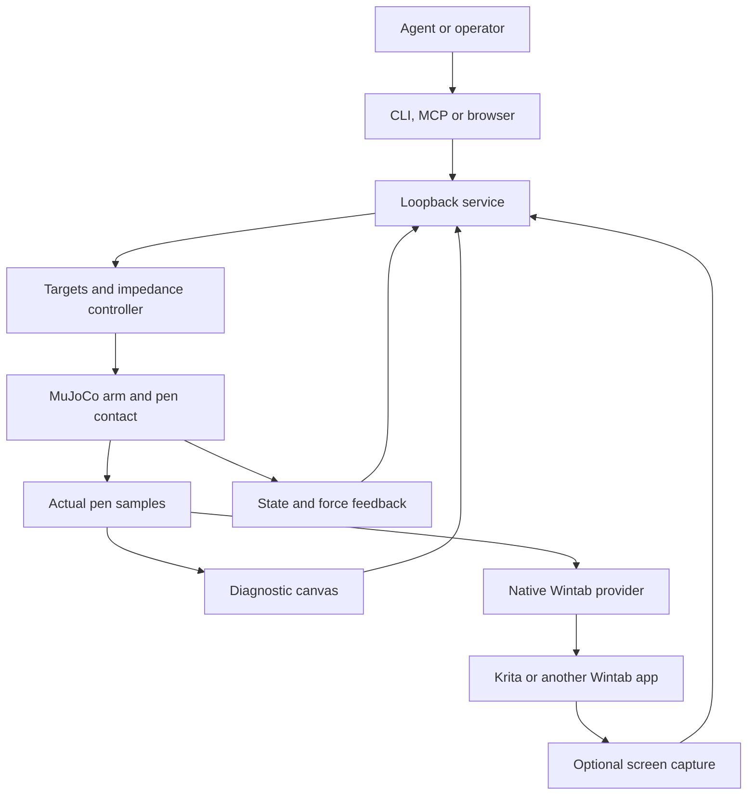

# Architecture

ChapArm separates continuous physical execution from discrete agent decisions.
The Windows process owns the arm state, contact solve and tablet publication.
An agent can run locally or use a cloud model through a local client.

## Physical execution

The model contains a fixed right shoulder, three shoulder hinge joints, an elbow
hinge, a forearm rotation joint, and two wrist hinges. The hand holds a fixed pen.
Positive elbow flexion bends the arm, with the neutral elbow below the shoulder.
MuJoCo integrates the articulated body and resolves pen/canvas contact and
friction. Cartesian impedance computes a desired end-effector wrench, which the
arm Jacobian maps to joint torques. Targets are not written directly into the
physical pen position. Inverse kinematics initializes the unloaded posture only.

Joint impedance supplies finite torques from position error and velocity. A
contact changes the physical solution, so actual motion can differ from the
requested trajectory. The controller's target and the resulting position are
both observations. Actual contact force is transformed into normalized pressure
for painting. The diagnostic canvas and native adapter consume these same actual
pen samples.

Small continuous disturbances, differing joint stiffness/damping and finite
actuator response produce controlled imperfection. This is a simplified humanlike
arm, not a musculoskeletal model. The first pen is rigid; contact compliance is
numerical constraint compliance, not a resolved bristle or skin simulation.
Only the spherical nib and finite canvas collide in this version. Arm/torso,
hand/table and self-collisions are not modeled.

MuJoCo uses a numerical contact model, so tiny contact penetration may occur.
“Blocked” means the contact constraint creates a reaction force and limits motion,
not that a finite-step solver promises mathematically zero penetration. See
[MuJoCo's contact computation](https://mujoco.readthedocs.io/en/stable/computation/index.html#contact).

## Service and action ownership

One persistent loop owns each simulation. Requests are validated before target
state is changed. Actions contain bounded trajectories or joint goals, duration
and optional force/control parameters. A returned action ID refers to execution;
acceptance is not completion. Polling and observation do not create new motion.

The loopback HTTP service supplies commands, state and PNG observations. CLI and
stdio MCP are clients of that service rather than separate simulation instances.
This allows a human to inspect an agent's action in the browser. Keep one active
operator; simultaneous clients can intentionally interfere with one another's
targets. The public service schema and defaults are documented in
[the agent guide](agent-guide.md).

The service is local-only. It does not expose arbitrary shell execution or a
general filesystem API. Request sizes, numeric values and trajectory lengths
are bounded. Screen return and native painting are separately enabled. It is
not an authenticated multi-user server and must not be exposed through a public
reverse proxy.

## Time and feedback

Physics time advances in fixed increments; wall-clock scheduling is best effort,
not a Windows hard-real-time guarantee. The agent submits a short action and
then observes or stops it. Contact reactions happen within the local simulation,
without waiting for model inference.

State includes actual joint and pen motion, target error, contact forces, applied
joint load and action identity. Reset advances an `epoch` while restarting
simulation time; frame counters and event sequence numbers remain monotonic
within the service process. Correlate observations using the epoch as well as
simulation time. Frame generation has its own cadence. A returned
screen image is sampled from the desktop, not from Krita's render fence; do not
assume an exact one-to-one correspondence between its pixels and a physics step.
Use observation/action timestamps, and take another observation after the brush
renderer settles if the final image is the evidence being assessed.

## Wintab boundary

Wintab applications query device capabilities and open contexts through
`Wintab32.dll`; each context defines its own coordinate mapping and packet fields.
The provider therefore implements this API and packet/message behavior, not just
a serialized “Wintab format.”
[Wacom's programming model](https://developer-docs.wacom.com/docs/icbt/windows/wintab/wintab-basics/)
describes these context and acquisition mechanisms.

ChapArm's Python publisher loads the native DLL's private bridge exports. The
painting application loads an application-local copy of the provider. A named
Windows shared-memory channel connects the two processes; `CHAPARM_SESSION`
selects the channel in the painting process and `--session` in ChapArm selects
the publisher channel. Both default to `default`.

The native status reports the consumer process, open/enabled contexts and a
consumer heartbeat. Its `ready` flag also requires the consumer to own the
foreground window; enabling output remains a separate operation.
“DLL loaded by Python” and “ready to draw into Krita” are
separate states. Only an enabled context from the expected application is
evidence that the application has opened this provider. A stale publisher causes
the provider to release contact rather than sustain the last pressure.

No system DLL, registry driver registration or installed tablet driver is
modified. This constraint limits applications with strict system-directory
loading policies. Compatibility must be recorded against an actual application
version and architecture; see [the Windows guide](windows-krita.md).

## Drawing and observation boundaries

The internal canvas provides a lightweight force-dependent trace for simulation
development and agents without Krita. It is not a professional brush engine.
Krita's brush engine produces the external artwork; its brush dynamics may add
their own pressure curve, smoothing and texture.

World-space canvas positions are mapped to a configured rectangle in desktop
pixels before native publication. That rectangle refers to the visible painting
area, not the entire application window. Moving the window, changing zoom/pan,
rotating the canvas, or changing display scaling can invalidate calibration.

Optional external observation captures desktop pixels. It cannot infer layer
data or application-space coordinates and does not automatically control the
painting application's menus. Full-canvas, local detail and short image
sequences can be implemented by an agent using repeated observations; continuous
video and historical recording are not required by the current interface.
